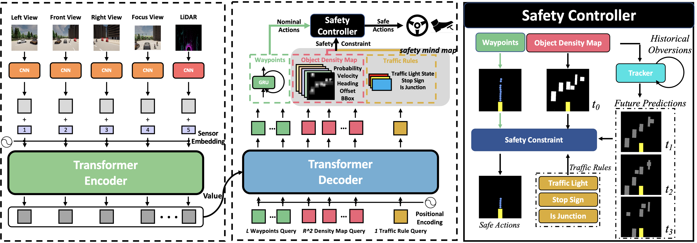

# InterFuser: Safety-Enhanced Autonomous Driving Using Interpretable Sensor Fusion Transformer

> [Hao Shao](http://hao-shao.com/), [Letian Wang](https://letianwang0.wixsite.com/myhome), RuoBing Chen, [Hongsheng Li](http://www.ee.cuhk.edu.hk/~hsli/), [Yu Liu](https://liuyu.us/)
> 
> [CoRL 2022](https://arxiv.org/abs/2207.14024)

[](https://paperswithcode.com/sota/autonomous-driving-on-carla-leaderboard?p=safety-enhanced-autonomous-driving-using-1)

This repository contains code for the paper [Safety-Enhanced Autonomous Driving Using Interpretable Sensor Fusion Transformer](https://github.com/opendilab/InterFuser). This work fully processes and fuses information from multi-modal multi-view sensors for achieving comprehensive scene understanding. Besides, intermediate interpretable features are generated from our framework, which provides more semantics and is exploited to better constrain actions to be within the safe sets.
Our method achieved new state-of-the-art on [CARLA AD Leaderboard](https://leaderboard.carla.org/leaderboard/) by June 11 2022.

## News

[12/21] Now, a similar dataset can be found in [here, hugging face](https://github.com/opendilab/LMDrive) or [openxlab](https://openxlab.org.cn/datasets/deepcs233/LMDrive). The only difference is the sample rate is 10Hz in that repo, instead of 2Hz of InterFuser.

## Demo Video


## Contents
1. [Setup](#setup)
2. [Dataset](#dataset)
3. [Data Generation](#data-generation)
4. [Training](#training)
5. [Evaluation](#evaluation)
6. [Acknowledgements](#acknowledgements)

## Setup
Install anaconda
```Shell
wget https://repo.anaconda.com/archive/Anaconda3-2020.11-Linux-x86_64.sh
bash Anaconda3-2020.11-Linux-x86_64.sh
source ~/.profile
```

Clone the repo and build the environment

```Shell
git clone https://github.com/opendilab/InterFuser.git
cd InterFuser
conda create -n interfuser python=3.7
conda activate interfuser
pip3 install -r requirements.txt
cd interfuser
python setup.py develop
```

Download and setup CARLA 0.9.10.1
```Shell
chmod +x setup_carla.sh
./setup_carla.sh
easy_install carla/PythonAPI/carla/dist/carla-0.9.10-py3.7-linux-x86_64.egg
```

**Note:** we choose the setuptools==41 to install because this version has the feature `easy_install`. After installing the carla.egg you can install the lastest setuptools to avoid *No module named distutils_hack*.

**Note:** FAQ: https://github.com/opendilab/InterFuser/issues/107

## Dataset
The data is generated with ```leaderboard/team_code/auto_pilot.py``` in 8 CARLA towns using the routes and scenarios files provided at ```leaderboard/data``` on CARLA 0.9.10.1

The collected dataset is structured as follows:
```
- TownX_{tiny,short,long}: corresponding to different towns and routes files
    - routes_X: contains data for an individual route
        - rgb_{front, left, right, rear}: multi-view camera images at 400x300 resolution
        - seg_{front, left, right}: corresponding segmentation images
        - depth_{front, left, right}: corresponding depth images
        - lidar: 3d point cloud in .npy format
        - birdview: topdown segmentation images required for training LBC
        - 2d_bbs_{front, left, right, rear}: 2d bounding boxes for different agents in the corresponding camera view
        - 3d_bbs: 3d bounding boxes for different agents
        - affordances: different types of affordances
        - measurements: contains ego-agent's position, velocity and other metadata
        - other_actors: contains the positions, velocities and other metadatas of surrounding vehicles and the traffic lights
```

## Data Generation
### Data Generation with multiple CARLA Servers
In addition to the dataset, we have also provided all the scripts used for generating data and these can be modified as required for different CARLA versions. The dataset is collected by a rule-based expert agent in differnet weathers and towns.

#### Running CARLA Servers
```bash
# start 14 carla servers: ip [localhost], port [20000 - 20026]
cd carla
CUDA_VISIBLE_DEVICES=0 ./CarlaUE4.sh --world-port=20000 -opengl &
CUDA_VISIBLE_DEVICES=1 ./CarlaUE4.sh --world-port=20002 -opengl &
...
CUDA_VISIBLE_DEVICES=7 ./CarlaUE4.sh --world-port=20026 -opengl &
```

Instructions for setting up docker are available [here](https://docs.nvidia.com/datacenter/cloud-native/container-toolkit/install-guide.html#docker). Pull the docker image of CARLA 0.9.10.1 ```docker pull carlasim/carla:0.9.10.1```.

Docker 18:
```
docker run -it --rm -p 2000-2002:2000-2002 --runtime=nvidia -e NVIDIA_VISIBLE_DEVICES=0 carlasim/carla:0.9.10.1 ./CarlaUE4.sh --world-port=2000 -opengl
```

Docker 19:
```Shell
docker run -it --rm --net=host --gpus '"device=0"' carlasim/carla:0.9.10.1 ./CarlaUE4.sh --world-port=2000 -opengl
```

If the docker container doesn't start properly then add another environment variable ```-e SDL_AUDIODRIVER=dsp```.

#### Run the Autopilot
Generate scripts for collecting data in batches.
```bash
cd dataset
python init_dir.py
cd ..
cd data_collection
python generate_yamls.py # You can modify fps, waypoints distribution strength ...

# If you don't need all weather, you can modify the following script
python generate_bashs.py
python generate_batch_collect.py 
cd ..
```

Run batch-run scripts of the town and route type that you need to collect.
```bash
bash data_collection/batch_run/run_route_routes_town01_long.sh
bash data_collection/batch_run/run_route_routes_town01_short.sh
...
bash data_collection/batch_run/run_route_routes_town07_tiny.sh
```

**Note1:** If you don't need all 14 kinds of weather in your dataset, you can modify the above code and scripts.

**Note2:** We also provide 7 kinds of night weather conditions in `leaderboard/team_code/auto_pilot.py`, you can modify the above code and scripts to collect the night dataset.

### Data Generation with a single CARLA Server
With a single CARLA server, rollout the autopilot to start data generation.
```Shell
carla/CarlaUE4.sh --world-port=2000 -opengl
./leaderboard/scripts/run_evaluation.sh
```
The expert agent used for data generation is defined in ```leaderboard/team_code/auto_pilot.py```. Different variables which need to be set are specified in ```leaderboard/scripts/run_evaluation.sh```. 

### Some Useful tools
We provide some useful python scripts in  `tools/data`, for example:
- `batch_merge_data.py`: merge several fragmented data items into one item, and then `interfuser/timm/data/carla_dataset.py` can be modified to reduce IO time.
- `batch_stat_data.py`: get statistical results of collected data
- `batch_preload.py`: compute the waypoints of all frames in one route and save to one file
- `batch_stat_blocked_data.py` and `batch_recollect_blocked_data.py`: find and delete the frames that the ego-vehicle is blocked for a long time

## Training

```bash
cd interfuser
bash scripts/train.sh
```

```bash
GPU_NUM=8
DATASET_ROOT='dataset/'

./distributed_train.sh $GPU_NUM $DATASET_ROOT  --dataset carla --train-towns 1 2 3 4 6 7 10  --val-towns 5 \
    --train-weathers 0 1 2 3 4 5 6 7 8 9  --val-weathers 10 11 12 13 \
    --model interfuser_baseline --sched cosine --epochs 25 --warmup-epochs 5 --lr 0.0005 --batch-size 16  -j 16 --no-prefetcher --eval-metric l1_error \
    --opt adamw --opt-eps 1e-8 --weight-decay 0.05  \
    --scale 0.9 1.1 --saver-decreasing --clip-grad 10 --freeze-num -1 \
    --with-backbone-lr --backbone-lr 0.0002 \
    --multi-view --with-lidar --multi-view-input-size 3 128 128 \
    --experiment interfuser_baseline \
    --pretrained
    

```

The `DATASET_ROOT` needs a file dataset_index.txt to list the traing/evaluation data. The format should be like the follow:

> route_path_dir data_frames_in_this_dir

> route_path_dir needs to be a relative path to `DATASET_ROOT`, the training code will concat the `DATASET_ROOT` and route_path_dir as the full path to load the data

for example:

> weather-7/data/routes_town06_long_w7_11_28_18_28_35/ 1062
> 
> weather-2/data/routes_town01_short_w2_11_16_08_27_10/ 1785
> 
> weather-2/data/routes_town01_short_w2_11_16_09_55_05/ 918
> 
> weather-2/data/routes_town02_short_w2_11_16_22_55_25/ 134
> 
> weather-2/data/routes_town01_short_w2_11_16_11_44_08/ 569
> ...

1062 is the number of the frames in weather-7/data/routes_town06_long_w7_11_28_18_28_35/rgb or weather-7/data/routes_town06_long_w7_11_28_18_28_35/rgb_front etc.

## Evaluation
Spin up a CARLA server (described above) and run the required agent. The adequate routes and scenarios files are provided in ```leaderboard/data``` and the required variables need to be set in ```leaderboard/scripts/run_evaluation.sh```.
Update ```leaderboard/scripts/run_evaluation.sh``` to include the following code for evaluating the model on Town05 Long Benchmark.
```shell
export CARLA_ROOT=/path/to/carla/root
export ROUTES=leaderboard/data/evaluation_routes/routes_town05_long.xml
export TEAM_AGENT=leaderboard/team_code/interfuser_agent.py
export TEAM_CONFIG=leaderboard/team_code/interfuser_config.py
export CHECKPOINT_ENDPOINT=results/interfuser_result.json
export SCENARIOS=leaderboard/data/scenarios/town05_all_scenarios.json
```
CUDA_VISIBLE_DEVICES=0 ./leaderboard/scripts/run_evaluation.sh

Use `ROUTES=leaderboard/data/42routes/42routes.xml` and `SCENARIOS=leaderboard/data/42routes/42scenarios.json` to run CARLA 42 routes Benchmark.

### Pretrain weights
We also provide examplery model weights for direct evaluation which can be downloaded at [here](http://43.159.60.142/s/p2CN). The model needs to be moved to `leaderboard/team_code/`.

**Note:** The model is trained on the part of the full dataset with several towns and weathers.


## Acknowledgements
This implementation is based on code from several repositories.
- [Transfuser](https://github.com/autonomousvision/transfuser)
- [2020_CARLA_challenge](https://github.com/bradyz/2020_CARLA_challenge)
- [CARLA Leaderboard](https://github.com/carla-simulator/leaderboard)
- [Scenario Runner](https://github.com/carla-simulator/scenario_runner)


## Citation
If you find our repo, dataset or paper useful, please cite us as
```bibtex
@article{shao2022interfuser,
 title={Safety-Enhanced Autonomous Driving Using Interpretable Sensor Fusion Transformer},
 author={Hao Shao and Letian Wang and RuoBing Chen and Hongsheng Li and Yu Liu},
 journal={arXiv preprint arXiv:2207.14024},
 year={2022},
}
```

## License
All code within this repository is under [Apache License 2.0](https://www.apache.org/licenses/LICENSE-2.0).
